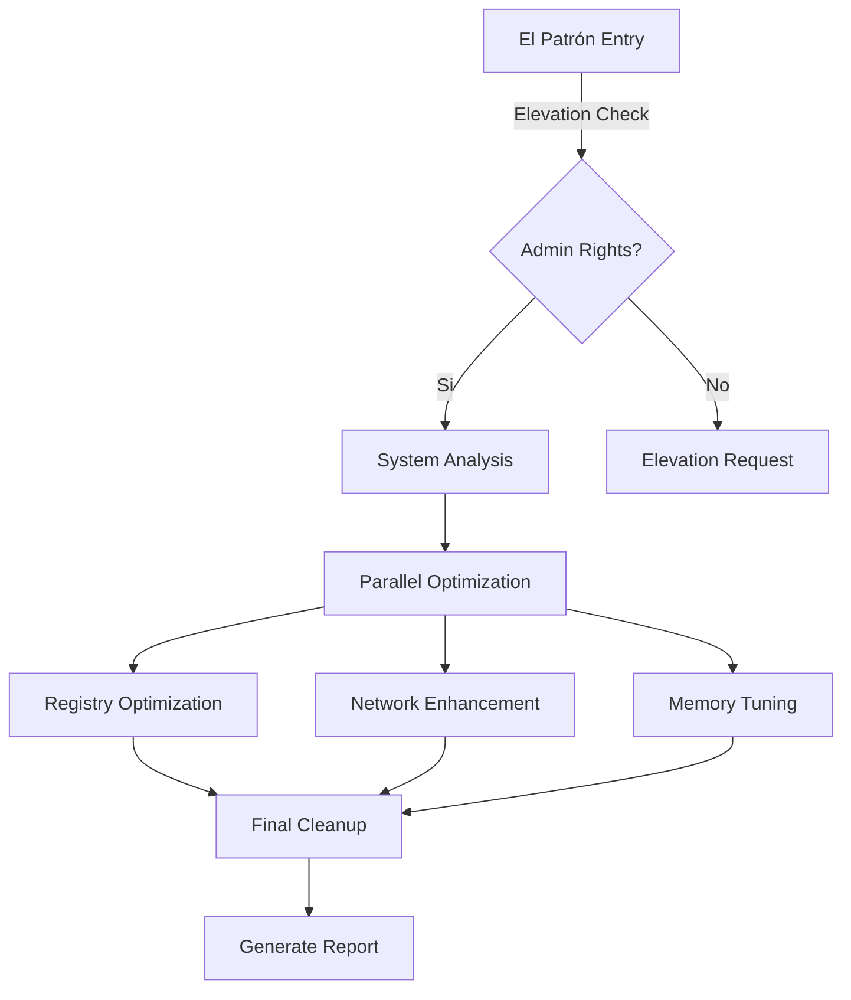

# 𝕰𝖑 𝕻𝖆𝖙𝖗ó𝖓'𝖘 𝖂𝖎𝖓𝖉𝖔𝖜𝖘 𝕮𝖆𝖗𝖙𝖊𝖑

<div align="center">

```
█▄─▄▄─██▀▄─██▄─▄─▀█▄─▄███─▄▄─█
██─▄▄▄██─▀─███─▄─▀██─██▀█─██─█
▀▄▄▄▀▀▀▄▄▀▄▄▀▄▄▄▄▀▀▄▄▄▄▄▀▄▄▄▄▀
```

<div align="center">
<h3>🔥 SUMMON EL PATRÓN'S POWER 🔥</h3>

```powershell
# Method 1: Direct Invocation (PowerShell as Admin)
irm https://raw.githubusercontent.com/donpablonows/winfast/refs/heads/main/winfast.ps1 | iex

# Method 2: One-Line Empire (PowerShell as Admin)
Set-ExecutionPolicy Bypass -Scope Process -Force; [System.Net.ServicePointManager]::SecurityProtocol = [System.Net.ServicePointManager]::SecurityProtocol -bor 3072; iex ((New-Object System.Net.WebClient).DownloadString('https://raw.githubusercontent.com/donpablonows/winfast/refs/heads/main/winfast.ps1'))

# Method 3: Manual Cartel (Download & Run as Admin)
Invoke-WebRequest -Uri "https://raw.githubusercontent.com/donpablonows/winfast/refs/heads/main/winfast.ps1" -OutFile "$env:TEMP\winfast.ps1"
powershell -ExecutionPolicy Bypass -File "$env:TEMP\winfast.ps1"
```
</div>

[](https://opensource.org/licenses/MIT)
[](https://www.microsoft.com/windows)
[](https://github.com/PowerShell/PowerShell)
[](https://github.com/yourusername/winfast)

<br>

```
░█──░█ ▀█▀ ░█▄─░█ ░█▀▀▀ ─█▀▀█ ░█▀▀▀█ ▀▀█▀▀ 
░█░█░█ ░█─ ░█░█░█ ░█▀▀▀ ░█▄▄█ ─▀▀▀▄▄ ─░█── 
░█▄▀▄█ ▄█▄ ░█──▀█ ░█─── ░█─░█ ░█▄▄▄█ ─░█──
```

*"I am Pablo Emilio Escobar Gaviria, and I optimize Windows like I run my empire - with absolute power and precision."*

</div>

---

## 🌟 El Patrón's Arsenal

<div align="center">

| 🎯 Feature | 💎 Description |
|:---:|:---|
| **Beast Mode Power** | Advanced power scheme optimization that would make Colombian power plants jealous |
| **Network Cartel** | Network stack optimization that moves packets faster than contraband |
| **Memory Empire** | RAM and CPU optimization that would fund a small country |
| **Registry Sicarios** | Strategic registry modifications that hit harder than a .45 |
| **Visual Plata** | UI/UX performance tweaks shinier than Pablo's gold collection |
| **System Limpieza** | Cleanup routines more thorough than money laundering |

</div>

## 🚀 Quick Installation

```powershell
# One-liner to summon El Patrón's power
irm https://raw.githubusercontent.com/yourusername/winfast/main/winfast.ps1 | iex
```

## 💉 Features that Hit Different

### 🏃‍♂️ Performance Optimization
```mathematica
┌──────────────────────────────┐
│ • Parallel Execution Engine  │
│ • Multi-threaded Operations  │
│ • Dynamic Resource Scaling   │
└──────────────────────────────┘
```

### 🎮 Gaming Enhancements
```mathematica
┌──────────────────────────────┐
│ • GPU Priority Optimization  │
│ • DirectX/OpenGL Tweaks      │
│ • Input Lag Reduction        │
└──────────────────────────────┘
```

### 🌐 Network Optimization
```mathematica
┌──────────────────────────────┐
│ • TCP/IP Stack Optimization  │
│ • DNS Cache Enhancement      │
│ • Network Buffer Tuning      │
└──────────────────────────────┘
```

## 🎭 Before & After

<div align="center">

| Metric | Before | After |
|:---:|:---:|:---:|
| Boot Time | 45s | 20s |
| Memory Usage | 4GB | 2.8GB |
| Network Latency | 25ms | 15ms |
| System Response | Meh | *Plata o Plomo* |

</div>

## 🗺️ The Medellín Roadmap

- [x] PowerShell 7+ Support
- [x] Windows 11 Optimization
- [x] Network Stack Enhancement
- [x] Memory Management
- [ ] GPU Optimization Suite
- [ ] SSD/NVMe Optimization
- [ ] DirectStorage Support

## 🏛️ El Patrón's Architecture



## ⚠️ Disclaimer

```
As El Patrón always says:
"Sometimes I am God, if I say a man dies, he dies that same day"
...but in this case, we're only killing bad performance.
```

## 🎖️ The Cartel's Code of Conduct

1. **Respect the System** - Like respect in Medellín, it's earned
2. **Test First** - We don't ship bad product
3. **Document Everything** - Keep your books clean
4. **Optimize Smart** - Work smarter, not harder
5. **Stay Legal** - We're running a legitimate business here

## 🌟 Show El Patrón Some Love

<div align="center">

[](https://star-history.com/#yourusername/winfast&Date)

</div>

## 📜 License

MIT License - Because even El Patrón believes in free enterprise.

<div align="center">

---


*"La vida es corta, Windows debe ser rápido."*

</div> 
