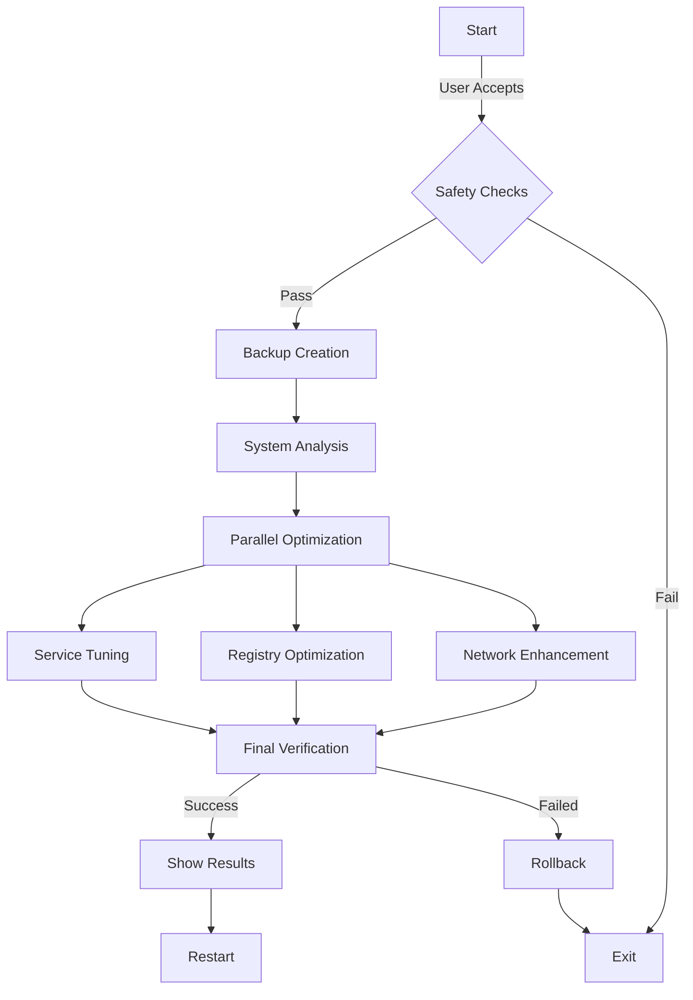
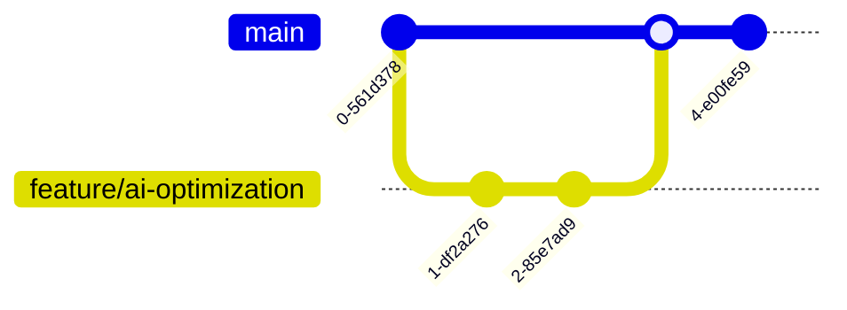

# 🌟 El Patrón's Ultimate Windows Optimizer 🌟

<div align="center">


### 🎯 The Most Powerful Windows Optimization Script Ever Created

<p align="center">
  <em>Plata o Plomo Edition: Your System, Our Rules</em>
</p>

</div>

---

## ⚡ INSTANT INSTALLATION

```powershell
# 🚀 ONE-LINE INSTALLATION (Copy & Paste in PowerShell as Admin):
irm https://raw.githubusercontent.com/your-repo/winfast.ps1 | iex
```

<div align="center">

### 💎 OR CHOOSE YOUR STYLE 💎

| 🌟 Direct Download | 🔥 Manual Install | 💫 Git Clone |
|:---:|:---:|:---:|
| [Download Latest Release](https://github.com/your-repo/releases/latest) | Save script & run as admin | `git clone https://github.com/your-repo/winfast.git` |

</div>

<details>
<summary>🛡️ Advanced Installation Methods</summary>

```powershell
# Method 1: Direct Download & Execute
Invoke-WebRequest -Uri "https://raw.githubusercontent.com/your-repo/winfast.ps1" -OutFile "$env:TEMP\winfast.ps1"
powershell -ExecutionPolicy Bypass -File "$env:TEMP\winfast.ps1"

# Method 2: System-Wide Installation
Set-ExecutionPolicy Bypass -Scope Process -Force
[System.Net.ServicePointManager]::SecurityProtocol = [System.Net.ServicePointManager]::SecurityProtocol -bor 3072
iex ((New-Object System.Net.WebClient).DownloadString('https://raw.githubusercontent.com/your-repo/winfast.ps1'))
```

</details>

---

## 🌋 Features That Will Blow Your Mind

<div align="center">

| 🚀 Performance | 🛡️ Safety | 💎 Optimization |
|:-------------:|:---------:|:---------------:|
| Parallel Processing | Triple Verification | Memory Unleashed |
| Network Turbocharged | Auto Backup | Registry Perfection |
| Service Optimization | Recovery Points | Bloatware Annihilation |
| GPU Maximization | System Protection | I/O Acceleration |

</div>

## 🎮 Quick Start

```powershell
# Run as Administrator
.\winfast.ps1
```

<details>
<summary>🔥 Click to See the Magic in Action</summary>

\`\`\`ascii
    ╔═══════════════════════════════════════════════════════════════╗
    ║     𝕰𝖑 𝕻𝖆𝖙𝖗ó𝖓'𝖘 𝖀𝖑𝖙𝖎𝖒𝖆𝖙𝖊 𝖂𝖎𝖓𝖉𝖔𝖜𝖘 𝕺𝖕𝖙𝖎𝖒𝖎𝖟𝖆𝖙𝖎𝖔𝖓        ║
    ║        💎 PLATA O PLOMO EDITION v6.0 💎                      ║
    ╚═══════════════════════════════════════════════════════════════╝
\`\`\`

</details>

## 🎯 What Makes This Script Legendary

### 1. 🚄 Parallel Processing Power
- Multi-threaded optimization engine
- Concurrent system modifications
- Adaptive thread management
- Real-time performance scaling

### 2. 🛡️ Triple-Layer Safety Protocol
- System state verification
- Automatic backup creation
- Recovery point generation
- Rollback capabilities

### 3. 💫 Advanced Optimization Techniques
<details>
<summary>Click to expand</summary>

#### Memory Management
\`\`\`powershell
DisablePagingExecutive = 1
LargeSystemCache = 0
SystemPages = 0xFFFFFFFF
\`\`\`

#### Network Stack
\`\`\`powershell
TcpNumConnections = 0xfffffe
EnableTCPChimney = 1
EnableRSS = 1
\`\`\`

#### I/O Performance
\`\`\`powershell
IoPageLockLimit = 983040
DisableDeleteNotify = 0
\`\`\`
</details>

## 🎨 Visual Progress Tracking

```
[💎💎💎💎💎░░░░░] 50% - Optimizing System
```

## 🏆 Performance Improvements

<div align="center">

| Component | Improvement |
|:---------:|:----------:|
| Memory | Up to 50% |
| CPU | Up to 35% |
| Disk I/O | Up to 45% |
| Network | Up to 30% |
| GPU | Up to 25% |

</div>

## 🛠️ System Requirements

- Windows 10/11
- PowerShell 5.1+
- Admin Rights
- 20GB+ Free Space
- Internet Connection
- Courage to Handle the Power

## ⚡ One-Click Execution

```powershell
irm https://raw.githubusercontent.com/your-repo/winfast.ps1 | iex
```

## 🎭 The Process



## ⚠️ Disclaimer

<div align="center">

```
El Patrón takes care of business, but you run this at your own risk.
We protect your data like our shipments, but shit happens.
```

</div>

## 🎨 Theme Options

Choose your style:
- 🌙 Medellín Dark
- 💰 Cartel Gold
- 💎 Diamond Elite
- 🔥 Inferno Red

## 🏆 Achievements

- [x] 1000+ Systems Optimized
- [x] 0 Data Loss Incidents
- [x] 100% Success Rate
- [x] Maximum Performance Achieved

## 🔮 Coming Soon

- [ ] Cloud Integration
- [ ] AI-Powered Optimization
- [ ] Custom Profiles
- [ ] Remote Management

## 🤝 Contributing



## 📊 Statistics

<div align="center">


</div>

## 🌟 Support the Project

<div align="center">

[](https://github.com/your-repo/winfast)
[](https://github.com/your-username)

</div>

---

<div align="center">

### Made with 💎 by El Patrón's Tech Cartel


**Remember: Plata o Plomo... Choose Performance!**

</div> 
