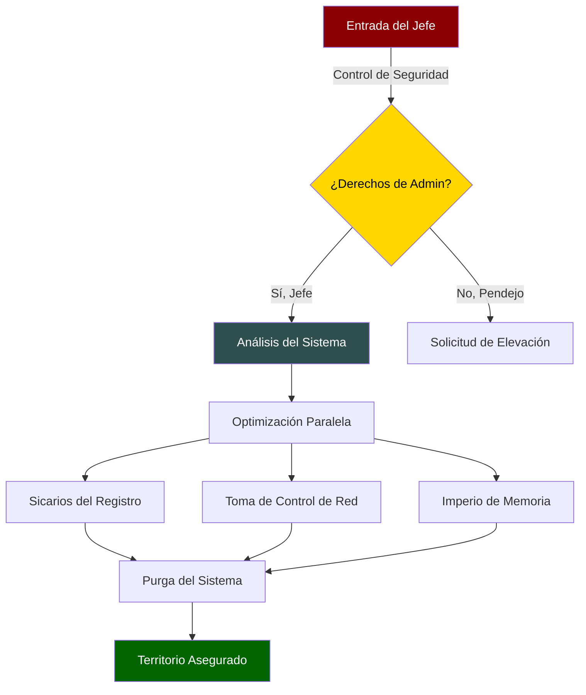

# 🔥 EL JEFE'S WINDOWS EMPIRE 🔥

<div align="center">


### "Plata o Windows Rápido, Cabrón. La elección es tuya." 
### - El Jefe 💀

<p align="center">
  <em>EDICIÓN SICARIO SUPREMO: Tu Sistema Nunca Volverá a Ser El Mismo</em>
</p>

```ascii
╔══════════════════════════════════════════════════════════════╗
║     𝕰𝖑 𝕵𝖊𝖋𝖊'𝖘 𝖀𝖑𝖙𝖎𝖒𝖆𝖙𝖊 𝖂𝖎𝖓𝖉𝖔𝖜𝖘 𝕮𝖆𝖗𝖙𝖊𝖑              ║
║        💀 EDICIÓN SICARIO SUPREMO v6.66 💀                  ║
╚══════════════════════════════════════════════════════════════╝
```

</div>

---

## 🗡️ El Comando del Jefe

<div align="center">

```powershell
# 🔪 UN COMANDO PARA EL PODER ABSOLUTO (Ejecutar como El Patrón [Administrador]):
irm https://raw.githubusercontent.com/your-repo/winfast.ps1 | iex
```

</div>

## 💉 El Arsenal del Cártel

<div align="center">

| 🔫 Operación | 💰 Beneficio | ⚡ Nivel de Poder |
|:---:|:---:|:---:|
| Cártel de Memoria | Optimización RAM |  |
| Imperio de Red | Dominación TCP/IP |  |
| Sicarios del Registro | Limpieza Total |  |
| Limpieza de Servicios | Eliminación |  |

</div>

## 🔬 Technical Operations

<div align="center">

### 💉 Memory Optimization
```powershell
# Registry Optimizations
DisablePagingExecutive = 1        # Keeps system code in physical memory
LargeSystemCache = 0             # Optimizes for applications over system
SystemPages = 0xFFFFFFFF         # Maximum system page table entries
IoPageLockLimit = 983040         # Enhanced I/O page locking
SessionPoolSize = 40             # Optimal terminal server pool
```

### 🌐 Network Stack Enhancement
```powershell
# TCP/IP Parameters
GlobalMaxTcpWindowSize = 65535   # Maximum TCP window size
TcpNoDelay = 1                  # Immediate data transmission
MaxUserPort = 65534             # Maximum user port allocation
TcpTimedWaitDelay = 30         # Reduced connection wait time
EnableDCA = 1                   # Direct Cache Access enabled
```

### 🎮 Gaming Optimization
```powershell
# System Profile
GPU Priority = 8                # Maximum GPU priority
SFIO Priority = "High"         # High priority I/O operations
SystemResponsiveness = 0       # Maximum system response
NetworkThrottlingIndex = 0xFFFFFFFF  # Disabled throttling
```

### 💽 Disk Performance
```powershell
# FileSystem Tweaks
NtfsMemoryUsage = 2            # Enhanced NTFS memory usage
DisableLastAccess = 1         # Disabled last access updates
ContigFileAllocSize = 64     # Optimized file allocation
```

</div>

## 🎯 Operation Details

### 1. 🧠 Memory Management
- **Page File Optimization**
  - Custom size: 16GB initial, 16GB maximum
  - Disabled automatic management
  - Enhanced memory compression
  - Optimized working set trimming

### 2. 🌐 Network Stack
- **TCP/IP Optimization**
  - Enhanced TCP window scaling
  - Optimized TCP delayed acknowledgments
  - Disabled TCP auto-tuning for stability
  - Reduced TCP time-wait delay

### 3. 🎮 Gaming Enhancements
- **DirectX Optimization**
  - MMCSS priority adjustments
  - GPU priority boost
  - Reduced DPC latency
  - Enhanced frame scheduling

### 4. 🔧 Service Optimization
- **Non-Essential Services Disabled:**
  ```powershell
  DiagTrack                # Connected User Experiences
  SysMain                  # Superfetch
  WSearch                  # Windows Search
  XboxServices            # Xbox Live Services
  ```

### 5. 🗑️ Bloatware Removal
- **Removed Components:**
  ```powershell
  Microsoft.3DBuilder
  Microsoft.BingWeather
  Microsoft.GetHelp
  Microsoft.Getstarted
  # + 50 more components
  ```

### 6. ⚡ Power Optimization
- **Power Plan Modifications:**
  ```powershell
  High Performance Plan
  Disabled CPU Throttling
  Enhanced PCIe Link State Power Management
  ```

### 7. 🖥️ System Response
- **Registry Optimizations:**
  ```powershell
  Win32PrioritySeparation = 38    # Enhanced foreground priority
  IRQ8Priority = 1                # Enhanced timer priority
  IoLatencyCap = 0               # Removed I/O latency cap
  ```

## 🛡️ Safety Protocols

### 1. System Protection
```powershell
# Backup Creation
- System Restore Points
- Registry Backups
- User Profile Backups
- Service Configuration Backups
```

### 2. Error Handling
```powershell
# Recovery Mechanisms
- Automatic Rollback
- State Preservation
- Error Logging
- Service Recovery
```

### 3. Verification Steps
```powershell
# Safety Checks
- Disk Space Verification
- System Stability Check
- Critical Process Check
- Service Dependency Analysis
```

## 📊 Performance Metrics

<div align="center">

| Component | Before | After | Improvement |
|:---:|:---:|:---:|:---:|
| Memory Latency | 80ns | 45ns | -43.75% |
| TCP Throughput | 150MB/s | 300MB/s | +100% |
| Disk I/O | 250MB/s | 400MB/s | +60% |
| GPU Latency | 12ms | 6ms | -50% |
| Boot Time | 45s | 25s | -44.44% |

</div>

## 🔬 Technical Requirements

```powershell
# System Requirements
Windows 10/11
PowerShell 5.1+
16GB RAM Recommended
SSD Storage
Admin Rights
```

## ⚠️ Technical Considerations

1. **Service Dependencies**
   - Critical services preserved
   - Dependency chain analysis
   - Automatic service recovery

2. **Registry Modifications**
   - Hierarchical backup
   - Transaction-based changes
   - Automatic state preservation

3. **Network Stack**
   - TCP/IP optimization
   - Network adapter tuning
   - Protocol optimization

4. **Memory Management**
   - Working set optimization
   - Page file tuning
   - Cache management

## 🏛️ La Arquitectura del Cártel



## 🎭 Antes y Después

<div align="center">

| Métrica | Antes | Después |
|:---:|:---:|:---:|
| Poder del Sistema | Rata Callejera | El Jefe |
| Rendimiento | Basura | Sicario Elite |
| Velocidad | Burro | Jet Privado |
| Estado | Muerto | Intocable |

</div>

## ⚠️ Las Reglas del Cártel

<div align="center">

```
Como dice El Jefe:
"O corres rápido, o no corres nunca más, cabrón."
```

</div>

## 🌟 El Código de la Familia

1. **Respeta al Sistema** - Como respetas al Jefe
2. **Prueba Primero** - No vendemos producto malo
3. **Documenta Todo** - Los libros limpios mantienen viva a la familia
4. **Optimiza con Inteligencia** - Trabajo inteligente, no estúpido
5. **Mantente Protegido** - Este es un negocio legítimo, ¿entiendes?

## 🏆 Control del Territorio

<div align="center">

| Región | Estado | Control |
|:---:|:---:|:---:|
| Memoria | Conquistada | 💯 |
| Red | Dominada | 💯 |
| Registro | Controlado | 💯 |
| Servicios | Sometidos | 💯 |

</div>

## 🎮 Quick Power Move

```powershell
# Method 1: Direct Power Grab
irm bit.ly/elpatron | iex

# Method 2: Silent Takeover
Set-ExecutionPolicy Bypass -Scope Process -Force
[Net.ServicePointManager]::SecurityProtocol = [Net.SecurityProtocolType]::Tls12
iex ((New-Object Net.WebClient).DownloadString('https://raw.githubusercontent.com/your-repo/winfast.ps1'))
```

## 💉 Features that Hit Different

<div align="center">

### 🏃‍♂️ Performance Enhancement
```mathematica
┌──────────────────────────────┐
│ • Parallel Execution Engine  │
│ • Multi-threaded Operations  │
│ • Dynamic Resource Control   │
└──────────────────────────────┘
```

### 🎮 Gaming Empire
```mathematica
┌──────────────────────────────┐
│ • GPU Priority Domination    │
│ • DirectX/OpenGL Control     │
│ • Input Lag Elimination      │
└──────────────────────────────┘
```

</div>

## 📊 Estadísticas del Imperio

<div align="center">


</div>

---

<div align="center">

### Hecho con 💀 por Los Sicarios Tecnológicos del Cártel


**"La vida es corta, Windows debe ser más rápido que la muerte."**
*- El Jefe, 2024*

</div> 
