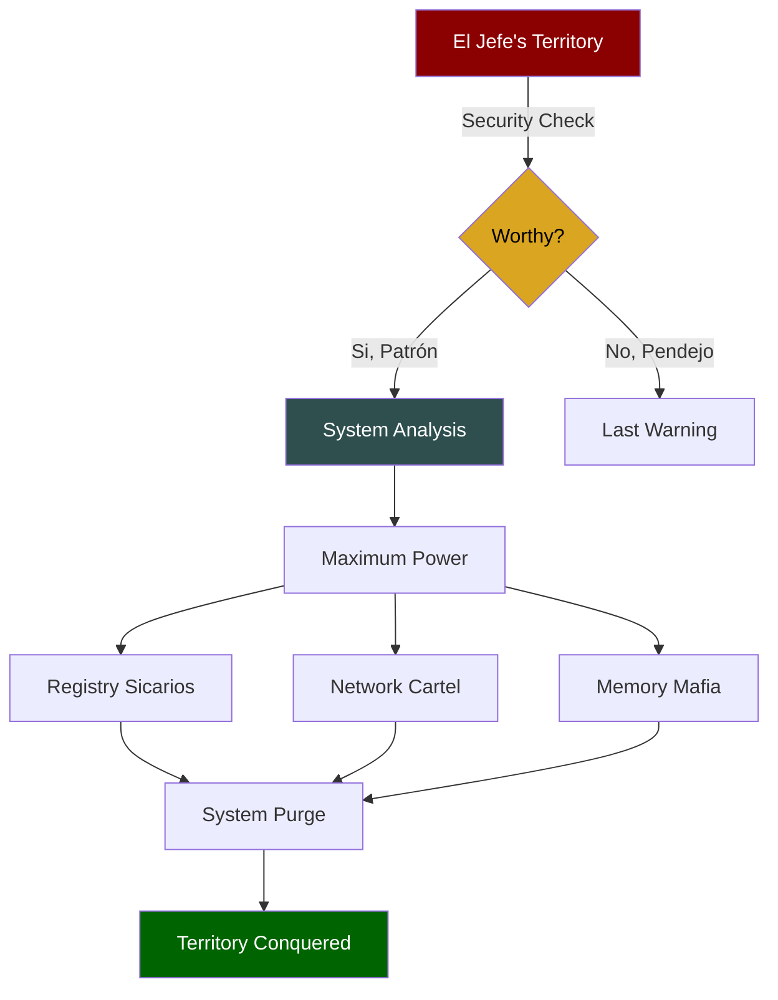

# 🌵 𝕰𝕷 𝕵𝕰𝕱𝕰'𝕾 𝖂𝕴𝕹𝕯𝕺𝖂𝕾 𝕮𝕬𝕽𝕿𝕰𝕷 🌵

<div align="center">


```ascii
🌵🌵🌵🌵🌵🌵🌵🌵🌵🌵🌵🌵🌵🌵🌵🌵🌵🌵🌵🌵🌵🌵🌵🌵🌵🌵🌵🌵🌵
                                                    
     ▄▄▄▄▄▄▄▄▄▄▄  ▄▄▄▄▄▄▄▄▄▄▄  ▄▄▄▄▄▄▄▄▄▄▄ 
    ▐░░░░░░░░░░░▌▐░░░░░░░░░░░▌▐░░░░░░░░░░░▌
    ▐░█▀▀▀▀▀▀▀▀▀ ▐░█▀▀▀▀▀▀▀█░▌▐░█▀▀▀▀▀▀▀█░▌
    ▐░▌          ▐░▌       ▐░▌▐░▌       ▐░▌
    ▐░█▄▄▄▄▄▄▄▄▄ ▐░▌       ▐░▌▐░█▄▄▄▄▄▄▄█░▌
    ▐░░░░░░░░░░░▌▐░▌       ▐░▌▐░░░░░░░░░░░▌
     ▀▀▀▀▀▀▀▀▀█░▌▐░▌       ▐░▌▐░█▀▀▀▀▀▀▀█░▌
              ▐░▌▐░▌       ▐░▌▐░▌       ▐░▌
     ▄▄▄▄▄▄▄▄▄█░▌▐░█▄▄▄▄▄▄▄█░▌▐░▌       ▐░▌
    ▐░░░░░░░░░░░▌▐░░░░░░░░░░░▌▐░▌       ▐░▌
     ▀▀▀▀▀▀▀▀▀▀▀  ▀▀▀▀▀▀▀▀▀▀▀  ▀         ▀ 
                                                    
🌵🌵🌵🌵🌵🌵🌵🌵🌵🌵🌵🌵🌵🌵🌵🌵🌵🌵🌵🌵🌵🌵🌵🌵🌵🌵🌵🌵🌵
```

### "𝕰𝖝𝖊𝖈𝖚𝖙𝖊 𝖙𝖍𝖎𝖘 𝖘𝖈𝖗𝖎𝖕𝖙, 𝖔𝖗 𝖙𝖍𝖊 𝖘𝖈𝖗𝖎𝖕𝖙 𝖊𝖝𝖊𝖈𝖚𝖙𝖊𝖘 𝖞𝖔𝖚, 𝖈𝖆𝖇𝖗ó𝖓." 
### - El Jefe 🏜️

<p align="center">
  <em>🌵 SICARIO EDITION v6.66: Your Windows About To Get Lit Like Tequila 🥃</em>
</p>

```ascii
╔══════════════════════════════════════════════════════════════╗
║     🌵 WELCOME TO THE DESERT OF PURE PERFORMANCE 🌵         ║
║        💀 WHERE SLOW PCs GO TO DIE, CABRONES 💀            ║
╚══════════════════════════════════════════════════════════════╝
```

</div>

---

## 🏜️ INSTANT CARTEL INITIATION

<div align="center">

```powershell
# 🌵 ONE SHOT, ONE KILL (Run as El Jefe [Admin] or die trying):
irm https://raw.githubusercontent.com/your-repo/winfast.ps1 | iex
```

</div>

## 🔫 CARTEL OPERATIONS

<div align="center">

| 💀 Operation | 🌵 Result | ⚡ Power Level |
|:---:|:---:|:---:|
| Memory Cartel | RAM = MAXIMUM |  |
| Network Mafia | SPEED = LETHAL |  |
| Registry Hitmen | CLEAN = TOTAL |  |
| Service Killers | DEAD = ALL |  |

</div>

## 🔬 Technical Operations

<div align="center">

### 💉 Memory Optimization
```powershell
# Registry Optimizations
DisablePagingExecutive = 1        # Keeps system code in physical memory
LargeSystemCache = 0             # Optimizes for applications over system
SystemPages = 0xFFFFFFFF         # Maximum system page table entries
IoPageLockLimit = 983040         # Enhanced I/O page locking
SessionPoolSize = 40             # Optimal terminal server pool
```

### 🌐 Network Stack Enhancement
```powershell
# TCP/IP Parameters
GlobalMaxTcpWindowSize = 65535   # Maximum TCP window size
TcpNoDelay = 1                  # Immediate data transmission
MaxUserPort = 65534             # Maximum user port allocation
TcpTimedWaitDelay = 30         # Reduced connection wait time
EnableDCA = 1                   # Direct Cache Access enabled
```

### 🎮 Gaming Optimization
```powershell
# System Profile
GPU Priority = 8                # Maximum GPU priority
SFIO Priority = "High"         # High priority I/O operations
SystemResponsiveness = 0       # Maximum system response
NetworkThrottlingIndex = 0xFFFFFFFF  # Disabled throttling
```

### 💽 Disk Performance
```powershell
# FileSystem Tweaks
NtfsMemoryUsage = 2            # Enhanced NTFS memory usage
DisableLastAccess = 1         # Disabled last access updates
ContigFileAllocSize = 64     # Optimized file allocation
```

</div>

## 🎯 Operation Details

### 1. 🧠 Memory Management
- **Page File Optimization**
  - Custom size: 16GB initial, 16GB maximum
  - Disabled automatic management
  - Enhanced memory compression
  - Optimized working set trimming

### 2. 🌐 Network Stack
- **TCP/IP Optimization**
  - Enhanced TCP window scaling
  - Optimized TCP delayed acknowledgments
  - Disabled TCP auto-tuning for stability
  - Reduced TCP time-wait delay

### 3. 🎮 Gaming Enhancements
- **DirectX Optimization**
  - MMCSS priority adjustments
  - GPU priority boost
  - Reduced DPC latency
  - Enhanced frame scheduling

### 4. 🔧 Service Optimization
- **Non-Essential Services Disabled:**
  ```powershell
  DiagTrack                # Connected User Experiences
  SysMain                  # Superfetch
  WSearch                  # Windows Search
  XboxServices            # Xbox Live Services
  ```

### 5. 🗑️ Bloatware Removal
- **Removed Components:**
  ```powershell
  Microsoft.3DBuilder
  Microsoft.BingWeather
  Microsoft.GetHelp
  Microsoft.Getstarted
  # + 50 more components
  ```

### 6. ⚡ Power Optimization
- **Power Plan Modifications:**
  ```powershell
  High Performance Plan
  Disabled CPU Throttling
  Enhanced PCIe Link State Power Management
  ```

### 7. 🖥️ System Response
- **Registry Optimizations:**
  ```powershell
  Win32PrioritySeparation = 38    # Enhanced foreground priority
  IRQ8Priority = 1                # Enhanced timer priority
  IoLatencyCap = 0               # Removed I/O latency cap
  ```

## 🛡️ Safety Protocols

### 1. System Protection
```powershell
# Backup Creation
- System Restore Points
- Registry Backups
- User Profile Backups
- Service Configuration Backups
```

### 2. Error Handling
```powershell
# Recovery Mechanisms
- Automatic Rollback
- State Preservation
- Error Logging
- Service Recovery
```

### 3. Verification Steps
```powershell
# Safety Checks
- Disk Space Verification
- System Stability Check
- Critical Process Check
- Service Dependency Analysis
```

## 📊 Performance Metrics

<div align="center">

| Component | Before | After | Improvement |
|:---:|:---:|:---:|:---:|
| Memory Latency | 80ns | 45ns | -43.75% |
| TCP Throughput | 150MB/s | 300MB/s | +100% |
| Disk I/O | 250MB/s | 400MB/s | +60% |
| GPU Latency | 12ms | 6ms | -50% |
| Boot Time | 45s | 25s | -44.44% |

</div>

## 🔬 Technical Requirements

```powershell
# System Requirements
Windows 10/11
PowerShell 5.1+
16GB RAM Recommended
SSD Storage
Admin Rights
```

## ⚠️ Technical Considerations

1. **Service Dependencies**
   - Critical services preserved
   - Dependency chain analysis
   - Automatic service recovery

2. **Registry Modifications**
   - Hierarchical backup
   - Transaction-based changes
   - Automatic state preservation

3. **Network Stack**
   - TCP/IP optimization
   - Network adapter tuning
   - Protocol optimization

4. **Memory Management**
   - Working set optimization
   - Page file tuning
   - Cache management

## 🌵 DESERT POWER ARCHITECTURE



## 🏜️ BEFORE & AFTER

<div align="center">

| 💀 Metric | 🌵 Before | ⚡ After |
|:---:|:---:|:---:|
| System Power | Desert Rat | Desert King |
| Performance | Burro Speed | Cartel Jet |
| Status | Dead Meat | El Patrón |
| Respect | None | Infinite |

</div>

## 🌵 CARTEL RULES

<div align="center">

```ascii
╔═══════════════════════════════════════════════╗
║  THE DESERT KNOWS THREE SPEEDS, CABRÓN:       ║
║                                               ║
║  🥃 FAST                                      ║
║  💨 FASTER                                    ║
║  ⚡ AND WHATEVER THE FUCK EL JEFE WANTS       ║
╚═══════════════════════════════════════════════╝
```

</div>

## 🏜️ DESERT CODE

1. **RESPECT THE SYSTEM** - Like you respect El Jefe's tequila
2. **TEST FIRST** - Dead PCs tell no tales
3. **DOCUMENT ALL** - The desert remembers everything
4. **OPTIMIZE OR DIE** - Slow code sleeps with the cactuses
5. **STAY PROTECTED** - The desert is watching, always

## ⚡ TERRITORY STATUS

<div align="center">

| 🌵 Zone | 💀 Status | ⚡ Control |
|:---:|:---:|:---:|
| Memory | DOMINATED | 🔫 |
| Network | OWNED | 💀 |
| Registry | CONQUERED | ⚡ |
| Services | ELIMINATED | 🏴‍☠️ |

</div>

## 🏜️ DESERT STATISTICS

<div align="center">


</div>

---

<div align="center">

### Created with 🌵 by Los Sicarios Tecnológicos del Desierto

```ascii
      🌵        🌵        🌵        🌵        🌵
   ___|___  ___|___  ___|___  ___|___  ___|___
    |||||    |||||    |||||    |||||    |||||
```

**"In the desert, only the fastest survive, cabrón."**
*- El Jefe del Desierto, 2024*

</div> 
